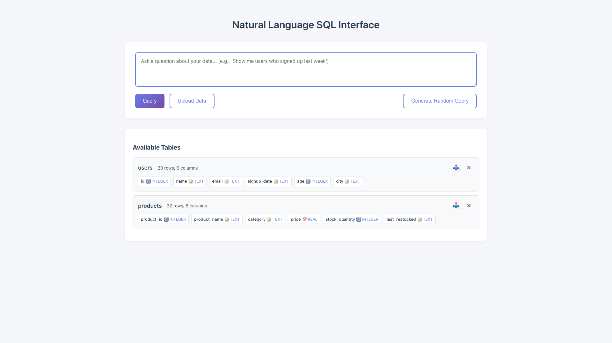
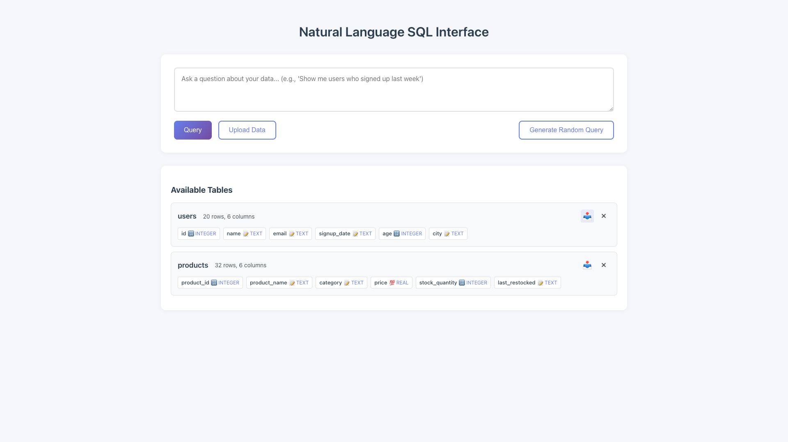
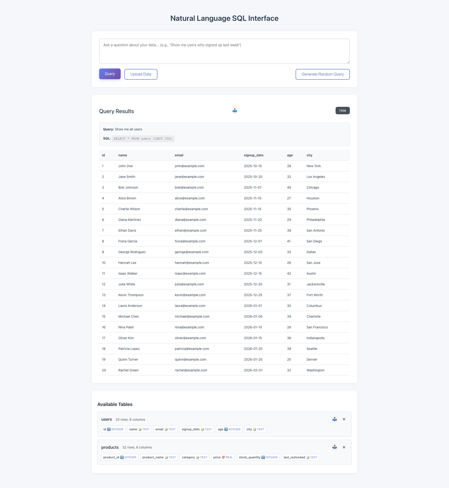
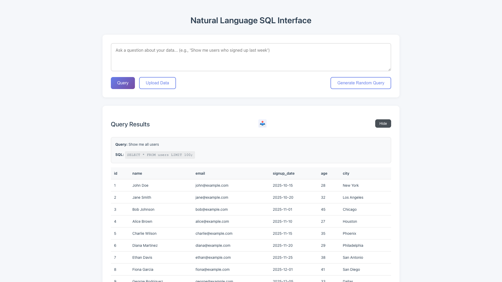

# One Click Table Exports

**ADW ID:** 1f259f43
**Date:** 2026-01-12
**Specification:** specs/issue-1-adw-1f259f43-sdlc_planner-one-click-table-exports.md

## Overview

This feature adds one-click CSV export functionality to the Natural Language SQL Interface application. Users can now export both database tables and query results as CSV files with a single button click, enabling seamless data extraction for use in external tools like Excel, Google Sheets, or other data analysis applications.

## Screenshots


*Download buttons (📥) positioned to the left of the remove (×) icon in the Available Tables section*


*Successful CSV download of a table with proper filename*


*Download button in the query results section, positioned to the left of the Hide button*


*Successful CSV download of query results with timestamped filename*

## What Was Built

- **Two new backend API endpoints** for CSV export functionality
- **Download buttons in the UI** for both tables and query results
- **CSV generation logic** with proper formatting, escaping, and UTF-8 encoding
- **Security validation** for table names and SQL queries
- **Custom styling** for download buttons consistent with the existing UI

## Technical Implementation

### Files Modified

- `app/server/server.py`: Added two new GET endpoints (`/api/table/{table_name}/export` and `/api/query/export`) with CSV generation logic, security validation, and proper HTTP headers for file downloads
- `app/client/src/main.ts`: Added download button creation and click handlers in `displayTables()` and `displayResults()` functions, plus `downloadTable()` and `downloadQueryResults()` helper functions
- `app/client/src/style.css`: Added `.download-table-button` and `.download-results-button` classes with hover effects and consistent styling
- `.claude/commands/e2e/test_one_click_table_exports.md`: Created comprehensive E2E test specification for the export functionality

### Key Changes

**Backend (app/server/server.py:310-427)**
- Implemented `GET /api/table/{table_name}/export` endpoint that validates table names, fetches all table data using secure SQL execution, converts results to CSV using Python's `csv` module, and returns the file with appropriate headers
- Implemented `GET /api/query/export` endpoint that accepts SQL queries via query parameter, validates security, executes queries, and returns results as downloadable CSV files with timestamped filenames
- Used `csv.writer` with `StringIO` for efficient CSV generation, ensuring proper escaping of special characters, quotes, and newlines
- Set HTTP headers: `Content-Type: text/csv; charset=utf-8` and `Content-Disposition: attachment; filename="{filename}.csv"` to trigger browser downloads
- Added comprehensive error handling (400 for invalid identifiers, 404 for missing tables, 500 for SQL errors)

**Frontend (app/client/src/main.ts:310-324, 214-233)**
- Added download button in `displayTables()` positioned between table info and remove button using a flex container for proper layout
- Added download button in `displayResults()` that appears only when query results exist, positioned before the Hide/Show toggle button
- Created `downloadTable(tableName: string)` function that navigates to the export endpoint via `window.location.href`
- Created `downloadQueryResults(query: string)` function that constructs export URL with SQL query parameter
- Used download icon emoji (📥) for table downloads and text label "Download" for query results

**Styling (app/client/src/style.css:316-356)**
- `.download-table-button`: Icon-only button with transparent background, hover effect showing primary color background and icon color change
- `.download-results-button`: Text-based button with solid background, hover effect with color change, subtle lift animation, and shadow

## How to Use

### Exporting a Table

1. Upload data to create a table in the "Available Tables" section
2. Locate the download icon (📥) to the left of the × icon for the table you want to export
3. Click the download button
4. A CSV file named `{table_name}.csv` will download to your default downloads folder

### Exporting Query Results

1. Execute a natural language query (e.g., "Show me all users")
2. View the query results in the Results section
3. Locate the "Download" button to the left of the "Hide" button
4. Click the Download button
5. A CSV file named `query-results-{timestamp}.csv` will download to your default downloads folder

### CSV File Format

Downloaded CSV files include:
- Column headers as the first row
- All data rows with proper CSV formatting
- UTF-8 encoding for international characters
- Proper escaping of commas, quotes, and special characters
- Empty fields for null values

## Configuration

No configuration required. The feature works out-of-the-box with:
- Default CSV format (comma-separated)
- UTF-8 encoding
- Automatic filename generation (table name or timestamp-based)

## Testing

### Manual Testing
1. Start the application: `./scripts/start.sh`
2. Upload sample data (e.g., `sample_data/users.json`)
3. Click download button for the table and verify CSV downloads
4. Execute a query: "Show me all users"
5. Click download button in results and verify CSV downloads
6. Open CSV files to confirm data integrity and formatting

### E2E Testing
Run the comprehensive E2E test:
```bash
# Read the test specification
cat .claude/commands/e2e/test_one_click_table_exports.md

# Execute the E2E test following the test specification
```

### Validation Commands
```bash
cd app/server && uv run pytest              # Run server tests
cd app/client && bun tsc --noEmit           # Type check frontend
cd app/client && bun run build              # Build frontend
```

## Notes

- **Security**: Table names and SQL queries are validated using the existing `sql_security` module to prevent SQL injection attacks
- **Performance**: CSV generation uses streaming via `StringIO` for memory efficiency with large datasets
- **Browser compatibility**: Uses standard `window.location.href` for downloads, which works across all modern browsers
- **Filename sanitization**: Table names are used directly in filenames (validated as safe identifiers)
- **Query results filename**: Uses format `query-results-YYYYMMDD-HHMMSS.csv` to ensure unique filenames
- **Empty tables**: Exporting empty tables produces CSV files with headers only
- **Large tables**: No pagination limits on export; entire table is exported in a single file
- **Future enhancements**: Could add options for JSON export, Excel format, custom delimiters (TSV), column selection, or progress indicators for large exports
